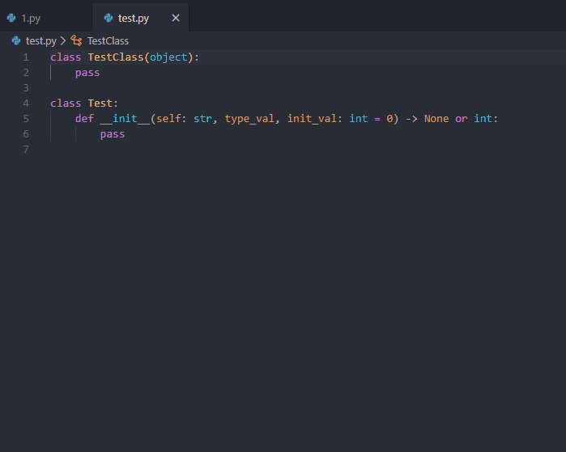

# python-docstring README

This is extension for generating python docstring (google-style for now) for classes/methods simply positioning cursor on needed line.

## Features

 - Generating docstring including parametres, return values and inheritance (for classes)

## Usage
 - Move cursor on the needed line
 - Bring up the command palette 
   - OSX: &#8984; + Shift + P
   - Windows: Ctrl + SHift + P
   - Linux: Ctrl + SHift + P
- Type "pydocstring" (or just start typeng "docstring", should do the trick)
- If you bind it to keyboard shortcut, usage will become much more easy!

## Known Issues

- One supported style
- Dont process decorators

## Contributions

I am not easy with TypeScript, so critism and advices are welcome, so as proposals to functionality.
