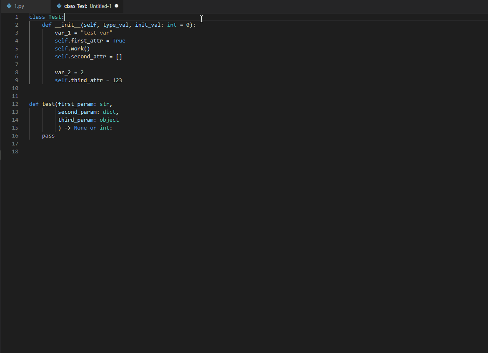

# python-docstring README

This is extension for generating python docstring (google-style for now) for classes/methods simply positioning cursor on needed line.

## Features

 - Generating docstring including parametres, return values, attributes and inheritance (for classes)

## Usage
 - Move cursor on the needed line
 - Bring up the command palette 
   - OSX: &#8984; + Shift + P
   - Windows: Ctrl + Shift + P
   - Linux: Ctrl + Shift + P
- Type "pydocstring" (or just start typing "docstring", should do the trick)
- If you bind it to keyboard shortcut, usage will become much more easy!

## Known issues and further develop

- One supported style
- Doesn`t process decorators
- Doesn`t process nested subscriptable types in declaration

## Contributions

TypeScript not really my language at all, so any contributioans are welcome, so as proposals to functionality.
